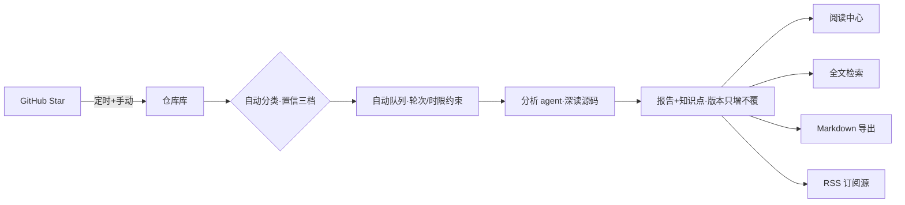

# 星剖 StarDissect

自托管的 GitHub Star 深度解析工具:自动同步并分类 star 收藏,由实现 agent 深读源码,生成证据可溯源的中文精读报告。

把「收藏即遗忘」变成「精读产出」—— 每条结论归属五类证据之一(源码事实/作者说明/分析推断/外部背景/未知冲突),源码事实锚定 `路径:行号` 与生成时的代码快照,可点开核对。

## 功能特性

- **自动同步**:star 列表定时/手动同步,fork 与 archive 自动过滤;取消收藏仅标记不删数据
- **智能分类**:七类主类型(应用/框架/CLI/教程/清单/论文/混合),输出判定理由与高/中/低置信;深读可修正分类,人工锁定不可被覆盖
- **分析队列**:自动推进可干预(暂停/优先级/取消/重试),agent 受轮次上限与任务时限双重约束,重启后任务状态完整恢复
- **证据化报告**:通用骨架+类型化模块的中文精读报告;目录锚点、排版校验、Markdown 导出、RSS 订阅
- **知识点沉淀**:带证据引用的知识点独立条目,随报告版本保存,支持全文检索
- **舒适阅读**:三档行宽/字号/行高/明暗主题,跨设备进度恢复(高水位防回退),miniflux 式键盘导航
- **全文检索**:报告/知识点/仓库元信息三域中文检索,按「报告>章节」分组命中

## 架构总览



模块化单体:FastAPI + SQLite(WAL+FTS5)+ pydantic-ai 分析 agent + Vue 3 前端。设计决策全部记录于 [docs/design/adr/](docs/design/adr/),每条引用真实开源实现作为证据。

## 快速开始

依赖:Python 3.13+ 与 [uv](https://docs.astral.sh/uv/)、Node 20+、git。

```bash
# 1. 配置密钥(不入库;.env 已被 .gitignore 排除)
cp .env.example .env   # 填入 GITHUB_TOKEN / AI_* / 搜索 key

# 2. 前端构建
cd web && npm install && npm run build && cd ..

# 3. 启动(仓库根运行;数据落 data/)
uv run --project server python -m uvicorn app.main:app --app-dir server --port 8000

# 4. 打开 http://127.0.0.1:8000 →「系统设置」核对配置 →「立即同步」
```

同步完成后仓库自动入队分析;新报告出现在「阅读中心」与 `/rss.xml`。

## 测试

```bash
uv run --project server pytest          # 真实调用无 mock;网络用例由环境变量门控
cd web && npm run build                  # 前端构建校验
```

## 文档地图

| 文档 | 内容 |
| ---- | ---- |
| [docs/PRD.md](docs/PRD.md) | 项目级需求视图(目标/流程/边界) |
| [docs/v1.0/prd.md](docs/v1.0/prd.md) | v1.0 详细规格(用户故事/验收准则/审计项) |
| [docs/TECH.md](docs/TECH.md) | 架构总览与决策索引 |
| [docs/design/adr/](docs/design/adr/) | 八份架构决策记录(含真实参考) |
| [docs/uiux/UIUX.md](docs/uiux/UIUX.md) | 界面设计定稿(tokens/排版/交互) |
| [docs/audit/](docs/audit/) | 纯净性与一致性审计报告 |

## Linux 服务部署

```bash
# 服务器上(示例为 systemd 用户服务)
git clone https://github.com/int2t05/StarDissect.git ~/apps/StarDissect
cd ~/apps/StarDissect && cp .env.example .env   # 填入密钥
(cd server && uv sync) && (cd web && npm install && npm run build)

mkdir -p ~/.config/systemd/user && cat > ~/.config/systemd/user/stardissect.service <<'UNIT'
[Unit]
Description=StarDissect
After=network-online.target

[Service]
Type=simple
WorkingDirectory=%h/apps/StarDissect
ExecStart=%h/apps/StarDissect/server/.venv/bin/python -m uvicorn app.main:app --app-dir server --host 0.0.0.0 --port 8000
Restart=on-failure
RestartSec=5

[Install]
WantedBy=default.target
UNIT

systemctl --user daemon-reload && systemctl --user enable --now stardissect
loginctl enable-linger $USER   # 重启/注销后自启
```

## 运行要点

- 数据:SQLite 单文件(`data/app.db`,WAL);日志:`data/logs/app.log`(轮转)
- 安全:应用无登录,仅限内网;暴露公网必须经反向代理鉴权;密钥只存服务端,界面仅回显尾号
- 边界:报告结论必须归属五类证据;编造引用是最高级错误,无法核实的引用一律降级为「未知」

## License

[MIT](LICENSE)
