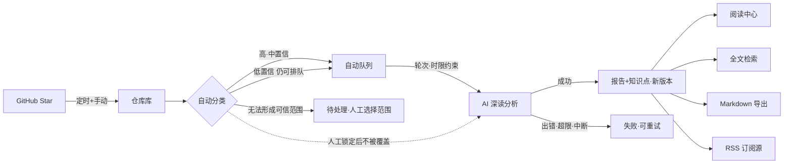
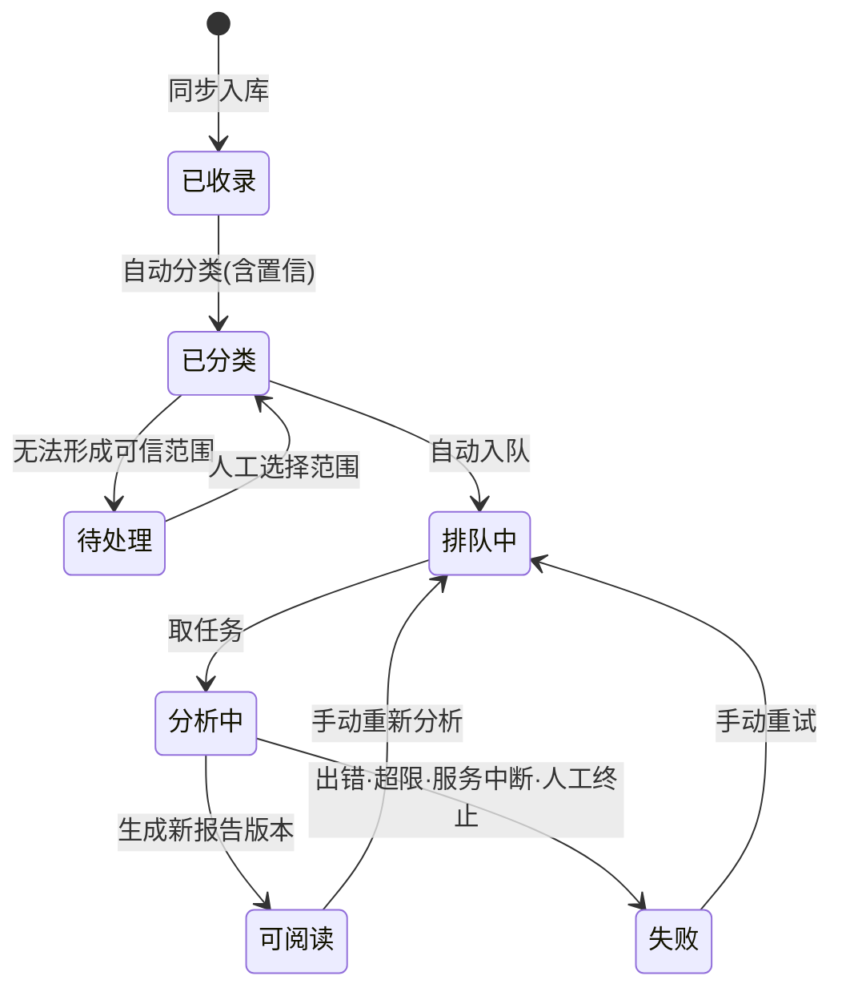
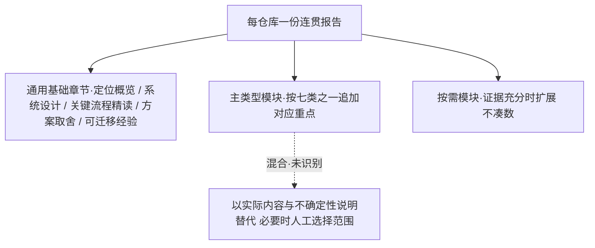

# PRD — StarDissect 星剖

<!-- 项目级需求视图:为谁解决什么问题、整体怎么流转、需求全景。
     行为细节与验收见 docs/v1.0/prd.md;界面规格见 docs/uiux/UIUX.md。 -->

| 项   | 值                                                            | 项     | 值                                       |
| ---- | ------------------------------------------------------------- | ------ | ---------------------------------------- |
| 版本 | v1.0(2026-10-09)                                              | 状态   | 已确认(2026-10-09)                        |
| 定位 | 为单人自用者解决「star 收藏即遗忘」:自动同步分类 GitHub star,生成证据可溯源的中文精读报告 | 读者   | 产品 · 研发 · 测试 · 审计                |
| 本版范围 | 同步 → 分类 → 队列 → 报告 → 阅读 → 检索 → 导出/RSS → 配置(→SCP-01) | 阻塞项 | 无阻塞;待决 OPN-01…08(见 v1.0/prd.md)   |

## 目标

| ID   | 目标                                                                                     |
| ---- | ---------------------------------------------------------------------------------------- |
| G-01 | 把 star 收藏从「存下即忘」变成「精读产出」:自动同步、分类,并为仓库生成中文深度报告       |
| G-02 | 结论可信:每条结论归属五类证据之一,可溯源、可抽查,事实与推断明确分离                      |
| G-03 | 阅读一等公民:舒适排版、跨设备进度恢复、知识点检索,报告生成后真正被读完                   |
| G-04 | 自主可控:自托管于内网,单人使用,数据与密钥不经过第三方界面                               |

## 用户场景

| ID     | 场景                                                                                             |
| ------ | ------------------------------------------------------------------------------------------------ |
| SCN-01 | 收藏沉淀:随手 star 一个好仓库,当晚它自动出现在仓库库中并完成分类排队,次日报告已就绪等精读 |
| SCN-02 | 深度精读:周末打开阅读中心续读上次进度,点开「源码事实」核对路径:行号,推断与事实一目了然     |
| SCN-03 | 检索复用:写方案时想不起某项目怎么做扩展机制,搜关键词直接命中报告章节与知识点                    |

## 整体流程

**FIG-01 端到端主流程**(异常分支:出错/超限/中断→失败可重试;无法形成可信范围→待处理)

**FIG-02 仓库分析状态**(人工锁定是分类上的标记,不是状态;重试与重分析均为手动;本图为任务态,存 tasks 表,仓库态见 tech.md §2)

**FIG-03 分类与报告模板体系**(各主类型的报告重点见下方表格)

### 主类型与报告重点

| 主类型             | 报告重点                                             |
| ------------------ | ---------------------------------------------------- |
| 应用/平台/服务     | 模块边界、数据流、部署、关键决策                     |
| 框架/库/SDK        | 抽象、接口契约、扩展、兼容性                         |
| CLI/工具/插件      | 工作流、配置、集成边界、分发                         |
| 教程/课程/示例     | 前置知识、内容组织、学习路径、生产适用边界           |
| Awesome/资源清单   | 主题结构、筛选依据、阅读优先级、抽样限制             |
| 论文实现/实验      | 研究问题、实现对应、实验条件、工程化限制             |
| 混合/未识别        | 明确实际内容与不确定性,必要时人工选择范围           |

### 分类与标签规则(细节见 REQ-CLS-001…005)

| 规则               | 内容                                                                                      |
| ------------------ | ----------------------------------------------------------------------------------------- |
| 置信               | 分类输出理由与高/中/低置信级别,不当统计概率                                              |
| 深读修正           | 分析中获得更强证据可修正分类(留记录),人工锁定的不得覆盖                                  |
| 低置信             | 不是自动失败,仍排队分析;无法形成可信范围才进「待处理」                                   |
| 人工标签 vs 知识点 | 分开显示:人工标签立即影响整理筛选;报告知识点随报告版本保存;人工编辑不得冒充分析结论       |

### 证据五类(视觉规格见 UIUX §8)

| 类型      | 含义                                   |
| --------- | -------------------------------------- |
| 源码事实  | 路径:行号,对应生成时的代码快照,可跳转 |
| 作者说明  | 仓库作者的自述与文档,外链+查阅时间     |
| 分析推断  | 由证据推出的判断,明确标注,不冒充事实  |
| 外部背景  | Issue/PR/第三方资料,外链+查阅时间     |
| 未知/冲突 | 证据不足或来源矛盾,明确呈现不强行消除 |

## 需求总览(索引;行为与验收见 v1.0/prd.md)

| 域     | 需求             | 一句话                                                   | 支撑      |
| ------ | ---------------- | -------------------------------------------------------- | --------- |
| 同步   | REQ-SYNC-001…003 | star 定时+手动同步入库,排除 fork/archive,结果可见       | G-01      |
| 分类   | REQ-CLS-001…005  | 七类自动分类+置信理由,人工锁定与标签,深读可修正         | G-01/G-02 |
| 任务   | REQ-TASK-001…006 | 自动队列可干预,轮次/时限限额,重试,手动重分析,中断恢复 | G-01/G-04 |
| 报告   | REQ-RPT-001…005  | 骨架+类型模块,证据五类,中文排版校验,版本只增不覆       | G-01/G-02 |
| 知识点 | REQ-KP-001…002   | 证据支持的知识点独立条目,随版本保存,与人工标签分离       | G-02/G-03 |
| 阅读   | REQ-READ-001…006 | 排版/目录/跨设备进度/键盘/证据交互/已读收藏             | G-03      |
| 检索   | REQ-SRCH-001…002 | 报告+知识点+仓库元信息全文检索,按「报告>章节」分组       | G-03      |
| 输出   | REQ-OUT-001…002  | 单篇 Markdown 导出;RSS 自用追踪订阅源                    | G-03      |
| 配置   | REQ-CFG-001…002  | 连接/AI/限额配置,密钥不回显,改限额不中断进行中任务     | G-04      |

## 范围与非目标

| ID     | 内容                                                                                                                                                            |
| ------ | --------------------------------------------------------------------------------------------------------------------------------------------------------------- |
| SCP-01 | v1.0 范围:star 自动同步、七类自动分类、自动分析队列(可干预)、中文精读报告(证据五类)、知识点、阅读中心(进度/格式/键盘)、全文检索、Markdown 导出、RSS、系统配置 |
| SCP-02 | 非目标(全项目):多用户与权限体系;自动触发重新分析;对外公开分享;报告质量评分门槛;把 TECH 层实现(框架/存储/算法)写进 PRD                                        |
| SCP-03 | v1.0 非目标:报告跨版本进度迁移;手动收录 star 之外的仓库;批量导出;仓库更新自动检测                                                                               |

## 版本路线图

| ID    | 里程碑                                                                                           |
| ----- | ------------------------------------------------------------------------------------------------ |
| MS-01 | v1.0 全量闭环(本版,→SCP-01)                                                                    |
| MS-02 | 候选方向(非承诺):批注/高亮、报告跨版本进度迁移、知识点库独立视图、更新检测提示、手动收录任意仓库 |

## 关键决策

| ID     | 决策                                                                                          |
| ------ | --------------------------------------------------------------------------------------------- |
| DEC-01 | 双层 PRD:项目级 docs/PRD.md(本文件)+ 版本级 docs/v1.0/prd.md                                  |
| DEC-02 | 快速原型优先:不设质量验证关,验收=功能闭环跑通+证据可抽查                                     |
| DEC-03 | 成本控制用「轮次上限+任务时限」约束,不做预算上限与成本验证                                    |
| DEC-04 | 无登录:信任内网,外网暴露由部署者自行反代保护;UX-31/33 的「账户配置」语义改为服务端全局设置    |
| DEC-05 | 知识点为独立条目实体,绑定报告版本,与人工标签分离显示;为知识点库视图预留                       |
| DEC-06 | 重新分析仅手动触发;报告版本只增不覆,旧版本可回看                                             |
| DEC-07 | 分类与模板:通用基础+主类型模板+按需模块,七类主类型,置信三档,人工锁定不可静默覆盖(用户定稿)  |
| DEC-08 | 收藏规模 200 以内:全量自动队列+可干预,不做复杂分批策略                                       |
| DEC-09 | 任务超限语义取轻量:达到轮次/时限上限即失败、可重试,不保留部分产出(「受限完成」状态移除)    |

## 边界

- **Always**:每条报告结论必须归属五类证据之一;新报告版本保留旧版本;人工锁定、人工标签、人工修订不被自动流程改写;报告正文为中文;源码引用必须对应真实代码快照。
- **Ask first**:更换 AI 供应商或默认限额;新增仓库入库通道(手动收录);调整七类模板体系;将阅读偏好从本地保存改为服务端;任何 v1.0 范围扩张。
- **Never**:静默覆盖或删除用户的人工决定;编造证据或引用不存在的代码位置;自动触发重新分析;把 TECH 层内容写进 PRD。
