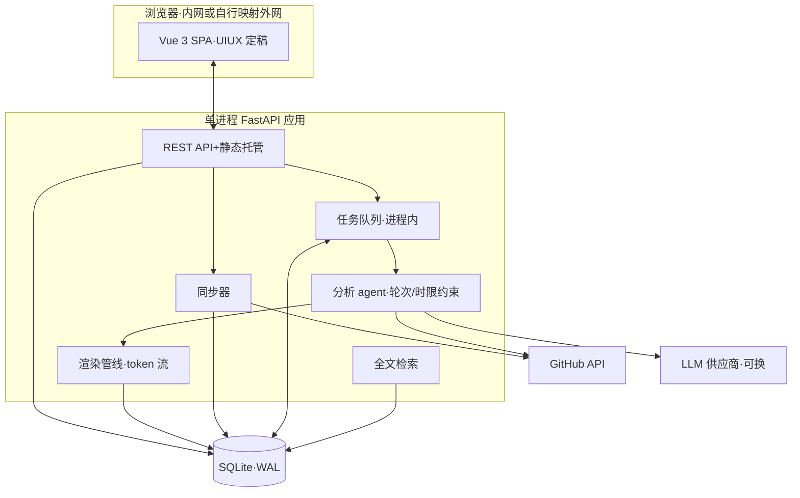

# TECH — StarDissect 星剖

<!-- 项目级架构总览:组件、数据层、NFR 落点、决策索引。实现细节见 docs/v1.0/tech.md;需求见 docs/PRD.md。 -->

| 项   | 值                                 | 项     | 值                                        |
| ---- | ---------------------------------- | ------ | ----------------------------------------- |
| 版本 | v1.0(2026-10-09)                   | 状态   | 草案(待人工审计)                          |
| 输入 | docs/PRD.md · docs/v1.0/prd.md · docs/uiux/UIUX.md | 决策记录 | docs/design/adr/0001…0008               |
| 读者 | 研发 · 测试 · 审计                 | 审计   | 本文 §AUD                                 |

> **全库 ID 体系约定**:PRD 层 G/SCN/SCP/REQ-域-NNN/NFR/AC/AUD/DEC/OPN/MS(docs/PRD.md 与 docs/v1.0/prd.md);界面规则 UX-xx(docs/uiux/UIUX.md);架构决策 ADR-NNNN(docs/design/adr/);本文图表 FIG-xx。

## 1. 架构总览

**FIG-01 单体部署形态**(单进程服务 + 内嵌库,无外部中间件;单用户内网自托管)

模式:**模块化单体**(ADR-0001)。理由:单用户、200 仓库规模、内网部署 —— 无分布式动机;miniflux/pocketbase 同形态先例。六模块按 PRD 域划分:同步(REQ-SYNC)、分类+任务(REQ-CLS/TASK)、agent 分析(REQ-RPT 核心)、渲染+检索+输出(REQ-RPT-003…005/SRCH/OUT)、阅读(REQ-READ,前端为主)、配置(REQ-CFG)。

## 2. 组件与职责

| 组件     | 职责(PRD 映射)                                          | 关键决策 |
| -------- | -------------------------------------------------------- | -------- |
| 同步器   | star 增量同步、fork/archive 过滤、结果计数(REQ-SYNC)    | ADR-0003 |
| 任务队列 | 分类入队、优先级、干预、限额执行、状态持久(REQ-TASK)   | ADR-0004 |
| 分析 agent | 分类初判 + 深读分析,产出报告/知识点/分类修正(REQ-CLS/RPT/KP) | ADR-0005 |
| 渲染管线 | Markdown→HTML、证据块结构化、目录/锚点、校验输入(REQ-RPT-002/003、READ-001/002) | ADR-0007/0008 |
| 检索     | 章节级索引、中文分词、命中回源(REQ-SRCH)                | ADR-0006 |
| 前端 SPA | 阅读中心/仓库库/分析管理/系统设置(REQ-READ 等)          | UIUX 定稿(Vue 3) |

## 3. 数据层(概览;DDL 见 v1.0/tech.md)

单一 SQLite 库(WAL;ADR-0002):业务表(repos/classifications/tags/tasks/report_versions/knowledge_points/reading_progress/sync_runs/settings)+ 三张 FTS5 检索虚表(自持分词副本,ADR-0006)。报告版本只增不覆(DEC-06);人工锁定/标签/修订由写入路径保证不被自动流程触碰(REQ-CLS-003/005、KP-002)。

## 4. NFR 落点

| NFR      | 机制                                                                                    |
| -------- | --------------------------------------------------------------------------------------- |
| NFR-01 限额 | pydantic-ai `UsageLimits.request_limit` + asyncio 墙钟超时,双约束在 agent 运行层强制(ADR-0005) |
| NFR-02 性能 | 章节级 FTS5 预建索引;报告 HTML 服务端预渲染存库,阅读页零渲染开销                           |
| NFR-03 可靠性 | SQLite WAL+单文件;任务状态持久库,重启后「分析中」标记中断(REQ-TASK-006)               |
| NFR-04 安全 | 密钥仅存 settings 表,API 永不回显明文;日志脱敏;无登录前提=内网/反代(DEC-04)           |
| NFR-05 响应式 | 前端断点按 UIUX §4 实现,390/768/1024/1440 手测                                        |

## 5. 失败模式与缓解

| 失败模式                 | 缓解                                                                       |
| ------------------------ | -------------------------------------------------------------------------- |
| LLM 调用失败/超时        | 网络类工具失败返回错误文本,agent 降级为未知证据;任务级失败可手动重试(REQ-TASK-004) |
| 任务执行中进程崩溃       | 启动扫描:进行中→标「中断」;产物写入以事务提交,无半成品(REQ-TASK-006)    |
| GitHub 限流              | 同步器本轮记「跳过」待下轮;agent 的 GitHub 工具失败降级为「作者说明/未知」证据 |
| 排版校验器故障           | 跳过校验并标注「未校验」(REQ-RPT-003)                                     |
| SQLite 并发              | 多短连接(每请求/每任务各自开合)+ WAL 串行写 + busy_timeout;单用户规模无争用风险 |

## 6. ADR 索引

| ADR    | 决策                                       | 一句话理由                                       |
| ------ | ------------------------------------------ | ------------------------------------------------ |
| 0001   | 模块化单体:Python + FastAPI               | 单用户内网,运维最小化;先例充分                  |
| 0002   | SQLite 单库(WAL + FTS5)                   | 嵌入式零运维,规模 200 仓库远低于阈值            |
| 0003   | GitHub 同步:gidgethub                     | 异步原生、轻量、与 FastAPI 同事件循环            |
| 0004   | 调度 APScheduler + 进程内 asyncio 队列     | 单机单用户,不引入消息中间件                     |
| 0005   | 分析 agent:pydantic-ai 工具循环           | 类型化输出、原生轮次限额,供应商一行切换         |
| 0006   | 中文检索:FTS5 + jieba 预分词              | SQLite 原生检索对中文失效,索引期分词最简        |
| 0007   | 目录锚点与命中回源:token map 行号          | 一份 token 流同时支撑目录、锚点、搜索回源        |
| 0008   | Markdown 服务端渲染:markdown-it-py 管线   | token 流同源供渲染/校验/索引,前端零渲染逻辑     |

## 人工审计(T-AUD;独立前缀,避免与 PRD 层 AUD 撞号)

| ID     | 检查问题                         | 证据要求                                   | 关闭标准                             |
| ------ | -------------------------------- | ------------------------------------------ | ------------------------------------ |
| T-AUD-01 | 参考真实性:8 份 ADR 引用可在 reference/ 或官方文档复核 | 逐条路径/行号核对           | 无虚构引用                           |
| T-AUD-02 | 参考贴合度:先例的规模/约束与本项目可比(单用户自托管)   | ADR 参考节                  | 差异已明示,无误用                   |
| T-AUD-03 | 落选方案权衡记录(huey/litellm/前端搜索/纯 trigram)     | 各 ADR 落选节               | 每项有否定理由                       |
| T-AUD-04 | NFR 可测性:NFR-01…05 均有机制与验收挂钩          | §4 对照 v1.0/prd.md NFR     | 一一对应,无悬空                     |
| T-AUD-05 | 失败模式覆盖 agent/队列/同步/渲染/存储           | §5                          | 每组件至少一条且与 REQ 异常分支一致  |
| T-AUD-06 | ADR-0007/0008 语义与 UIUX.md 引用处一致          | 对照 UIUX L52/L114/L157     | 三处引用全部闭合,含义无漂移         |
| T-AUD-07 | 约束复核:报告版本只增不覆、人工数据写入隔离在数据层成立 | v1.0/tech.md 数据模型       | 约束可由 schema+写入路径保证         |
| T-AUD-08 | 可逆性:供应商/校验器/分词器可替换的边界是否真实  | ADR-0005/0006/0008          | 替换点单一,无扩散                   |
