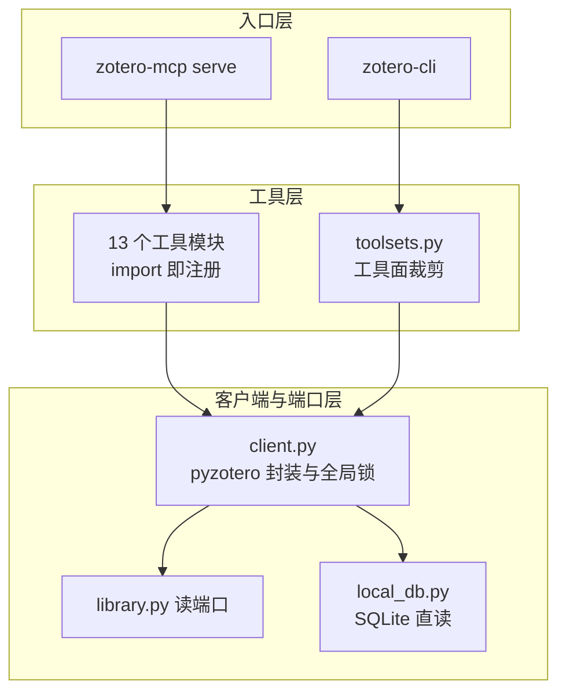

# Mermaid 浏览器验收

## 用户报告的 Zotero MCP 组件图

```mermaid
graph TB
subgraph L1["入口层"]
  CLI["zotero-mcp serve"]
  SA["zotero-cli"]
end
subgraph L2["工具层"]
  TOOLS["13 个工具模块<br/>import 即注册"]
  TS["toolsets.py<br/>工具面裁剪"]
end
subgraph L3["客户端与端口层"]
  CLIENT["client.py<br/>pyzotero 封装与全局锁"]
  PORT["library.py 读端口"]
  LDB["local_db.py<br/>SQLite 直读"]
end
CLI --> TOOLS
SA --> TS
TOOLS --> CLIENT
TS --> CLIENT
CLIENT --> PORT
CLIENT --> LDB
```

## 失败回退

```mermaid
graph TB
A -->
```
